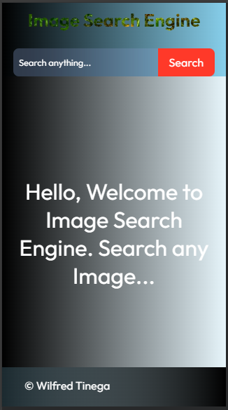

# Image Search Engine

A sleek and intuitive web application that allows users to search for high-quality images using the [Unsplash API](https://unsplash.com/developers). This project demonstrates API integration, responsive design, and clean code practices.

---

## Features

- **Search Images**: Enter a keyword to retrieve relevant images from Unsplash.
- **Infinite Scrolling**: Automatically loads more results as you scroll down.
- **Responsive Design**: Optimized for all devices, from mobile to desktop.
- **Copy Link**: Easily copy the image URL for sharing.

---

## Technologies Used

- **Frontend**:
  - HTML5
  - CSS3 (Flexbox & Grid)
  - JavaScript (ES6+)
- **Frameworks/Libraries**:
  - Vanilla JS
  - API requests
- **Styling**:
  - sass
- **API**:
  - [Unsplash API](https://unsplash.com/developers)

---

## Getting Started

### Prerequisites

Before you begin, ensure you have the following installed:

- Node.js (if using React or other JS frameworks)
- A text editor like VSCode
- A valid [Unsplash API key](https://unsplash.com/join) (free account required)

### Installation

1. Clone the repository:
   ```bash
   git clone https://github.com/your-username/image-search-engine.git
   cd image-search-engine
   ```

2. Install dependencies (if using React or similar):
   ```bash
   npm install
   ```

3. Create a `.env` file to store your Unsplash API key:
   ```plaintext
   REACT_APP_UNSPLASH_ACCESS_KEY=your_unsplash_api_key
   ```

4. Start the development server:
   ```bash
   npm start
   ```

   For Vanilla JS, just open `index.html` in your browser.

---

## Usage

1. Open the app in your browser.
2. Use the search bar to enter keywords (e.g., "nature", "city", "technology").
3. Scroll through the results or click on an image to preview it.

---

## API Documentation

This project utilizes the Unsplash API. Learn more about endpoints and rate limits [here](https://unsplash.com/documentation).

### Example API Call:
```javascript
const url = `https://api.unsplash.com/search/photos?query=YOUR_QUERY&client_id=YOUR_ACCESS_KEY`;
```

---

## Folder Structure

```plaintext
image-search-engine/
├── public/
│   ├── index.html
│   └── styles.css
├── src/
│   ├── components/
│   ├── utils/
│   ├── App.js
│   ├── index.js
│   └── api.js
├── .env
├── README.md
└── package.json
```

---

## Future Improvements

- Add user authentication for personalized features.
- Implement a favorites gallery.
- Allow users to download images directly.
- Add pagination as an alternative to infinite scrolling.
---

## Acknowledgments

- [Unsplash](https://unsplash.com) for the free API and high-quality images.
- Inspiration from [unsplash-image-search](https://github.com).

---

## Screenshots


